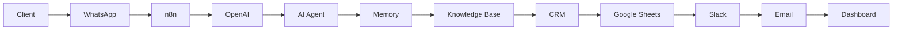

# 👋 Hi, I'm Mahmoud Othman

### 🚀 AI Automation Engineer • n8n Developer • AI Agent Builder

AI Automation • AI Agents • n8n • LLMs • APIs • Business Automation

---

# ⚡ About Me

I'm an AI Automation Engineer specializing in building intelligent automation systems using modern AI technologies.

My mission is simple:

> Automate everything that wastes human time.

I design scalable automation solutions that connect businesses with AI through workflows, APIs, Large Language Models, and intelligent agents.

### 🔥 I specialize in

- 🤖 AI Agents
- ⚡ n8n Automation
- 💬 WhatsApp Automation
- 📧 Email Automation
- 📄 OCR Automation
- 🧠 RAG Systems
- 🌐 REST APIs
- 🔗 Webhooks
- 📊 CRM Automation
- 📅 Google Workspace Automation
- 🛒 E-commerce Automation
- 🏢 Internal Business Automation

---

# 🚀 What I Build

✅ AI Employees

✅ AI Customer Support

✅ AI Receptionists

✅ AI Sales Agents

✅ AI Lead Qualification

✅ WhatsApp AI Bots

✅ Email Automation

✅ CRM Automation

✅ Workflow Automation

✅ PDF AI Processing

✅ Knowledge Base Chatbots

✅ Appointment Booking Systems

---

# 🛠 Tech Stack

## AI

---

## Automation

---

## Databases

---

## Google

---

## Communication

---

## Development

---

# 💼 Services

- AI Automation
- AI Agents
- n8n Workflows
- Business Automation
- CRM Automation
- Lead Generation Automation
- WhatsApp Bots
- AI Chatbots
- API Integration
- AI Consulting
- Document Automation
- OCR Systems
- AI Dashboards
- Internal Company Automation
- Workflow Optimization
---

# 🚀 Featured AI Automation Projects

<table>
<tr>
<td width="50%">

## 🤖 AI Customer Support Agent

- GPT-4 / OpenAI
- n8n Automation
- Memory
- Knowledge Base
- Human Handoff
- WhatsApp Integration

</td>

<td width="50%">

## 🦷 Dental Clinic Automation

- Appointment Booking
- WhatsApp Reminders
- Google Calendar
- CRM Sync
- AI Receptionist

</td>
</tr>

<tr>
<td width="50%">

## 📧 AI Email Assistant

- Auto Classification
- AI Reply Generation
- Gmail Automation
- Slack Notifications
- Smart Labels

</td>

<td width="50%">

## 📄 AI OCR Workflow

- PDF Processing
- OCR Extraction
- AI Structuring
- Google Sheets Export
- Database Storage

</td>
</tr>

<tr>
<td width="50%">

## 💼 CRM Automation

- Lead Qualification
- Pipeline Updates
- AI Follow-up
- Sales Automation
- Reporting

</td>

<td width="50%">

## 🛒 E-Commerce Automation

- Order Processing
- Customer Notifications
- Inventory Sync
- Invoice Generation
- AI Support

</td>
</tr>
</table>

---

# 🧠 AI Automation Architecture

---

# 📊 GitHub Analytics

---

---

# 🏆 GitHub Trophies

---

# 📈 Contribution Graph

---

# 🐍 Contribution Snake

> **Note:** You'll need to enable a GitHub Action to generate the snake animation.

---

# 🎯 Current Focus

- 🤖 Enterprise AI Agents
- ⚡ Advanced n8n Automation
- 🧠 Retrieval-Augmented Generation (RAG)
- 🔍 Vector Databases
- 🌐 MCP (Model Context Protocol)
- 📈 Business Process Optimization
- ☁️ Cloud Deployments
- 🔗 API Integrations

---

# 💡 Core Values

- Build once, automate forever.
- Simplicity scales.
- AI should solve real business problems.
- Every repetitive task deserves automation.
- Focus on impact, not complexity.

---

# 🌍 Connect With Me

---

# 🚀 Let's Build the Future with AI Automation

*"Automation is not about replacing people — it's about empowering them to do what matters most."*

⭐ **If you like my work, consider following my journey and exploring my repositories.**

